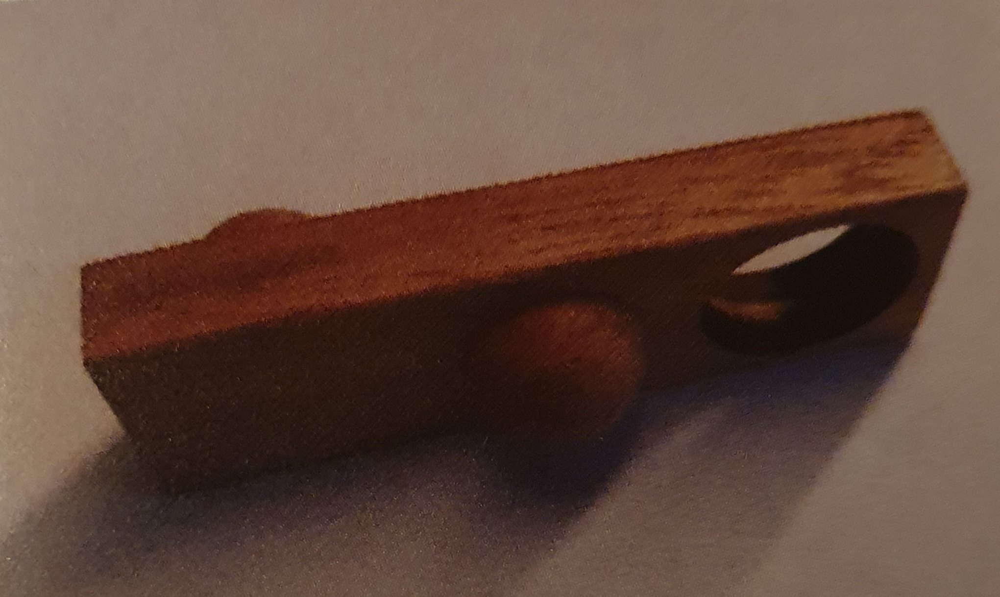

# AP-2024-Rust
Software developer final exam 2024 implementation in Rust.

This implementation was part of my final exam and while I originally implemented it in C#, I also decided to implement it in Rust to learn that language.

## Task definition
- Your company created a wooden puzzle with a cubic box and multiple layers
  
- There are puzzle pieces with the same length as the box and the width 1
- If the box length and width is n, a piece will also have n cells
- These cells can be empty or contain a hole on both sides or a hemisphere on either one or both sides
  
  
- The pieces get turned by 90° in each layer
- Because of the hemispheres on the pieces, they can only be arranged like that
  1) Hemisphere on hole
  2) Empty on empty
  3) Empty on hole
  4) Hole on hole
- The lowest layer has holes everywhere so that any piece can be placed on it
- Puzzle pieces can be turned in any direction
- Example: ``Up, Down, Hole`` can be turned into
  1) ``Down, Up, Hole`` (Turned 90° vertically)
  2) ``Hole, Down, Up`` (Turned 90° horizontally)
  3) ``Hole, Up, Down`` (Turned 90° in both directions)
- Now the company wants you to write a program which reads an input of puzzle pieces and finds a valid solution for the puzzle

## Program requirements
1) Import data: Reading the box size, number of layers and puzzle pieces from an input file
2) Store data: Storing said data in a suiting data structure
3) Solving: Determining a possible solution in compliance with the rules defined by the task definition
4) Output: Creating an output file with the solution

## Input example
```
//**********************************************
//Example 1
//**********************************************
Dimension 3,3,2
A 1,2,1
B 2,0,1
C 2,1,0
D 2,0,0
E 2,2,1
F 0,1,2
```

1) ``Line 1 - 3``: There can be comments starting with ``//`` which should appear in the output too
2) ``Line 4``: Defines the box size and number of layers, length and width should always match
3) ``Line 5-10``: Defines puzzle pieces with a label (single uppercase letter) and the encoded cells
4) ``Encoding``:
   0) Hole on both sides of the piece
   1) Hemisphere on top of the piece, empty at the bottom
   2) Hemisphere at the bottom of the piece, empty on top
   3) Hemisphere on both sides
   4) Empty on both sides
  
## Output example
```
//**********************************************
//Example 1
//**********************************************
Dimension 3,3,2
Piece placement
Layer 2
1 1 2 E
0 2 1 F
1 0 0 D

Layer 1
2 2 0
1 0 2
2 1 1
A B C
```

1) ``Line 1 - 3``: Comments from the input file
2) ``Line 4 - 5``: Dimensions from the input file
3) ``Line 6``: Layers from top to bottom of the box
4) ``Line 7 - 9``: Turned pieces in the current layer with their encoding
5) ``Line 11 - 15``: Non-turned layer with its pieces and their encoding

## Solving algorithm
Solving the problem by using a recursive backtracking algorithm
```rs
//current object
struct Solver {
    //pieces that weren't placed in the box yet
    pieces:Vec<Piece>,
    //resulting puzzlebox, not relevant for the algorithm below
    fullcontainer:Option<Box>
}

//self: reference to the current object
//piece: current puzzle piece starting from 0
//container: puzzlebox with its assigned pieces
fn solve(&mut self, piece:usize, container:&mut Box) -> bool {
    //create a copy so that we can backtrack to the current state later in case our current attempt failed
    let mut copy = self.clone();
    //remove the last assigned piece from the copy to indicate that it's already in the puzzle box
    if piece > 0 {
        copy.remove_piece(piece - 1, container);
    }
    //we found a valid solution if we managed to assign all pieces
    if copy.pieces.len() == 0 {
        return true;
    }
    //loop through all unassigned pieces and their permutations (rotations) to see if one fits in the current position
    for i in 0..copy.pieces.len() {
        let permutations = copy.pieces[i].get_permutations();
        for j in 0..permutations.len() {
            //find the current layer and position where the piece should be placed
            let layer = self.get_layer(piece, container);
            let pos = self.get_pos(piece, container);
            //check if the piece can be placed, if yes we add it to the box
            if container.is_allowed(permutations[j].clone(), layer, pos) {
                container.insert(permutations[j].clone(), layer, pos);
                //repeat this process for the next piece if the current one fits in the place
                if copy.solve(piece + 1, container) {
                    //if the partial solution succeeds, this one succeeds too
                    return true;
                }
            }
        }
    }
    //no piece fits in the current place, so the (partial) solution isn't valid
    false
}
```
